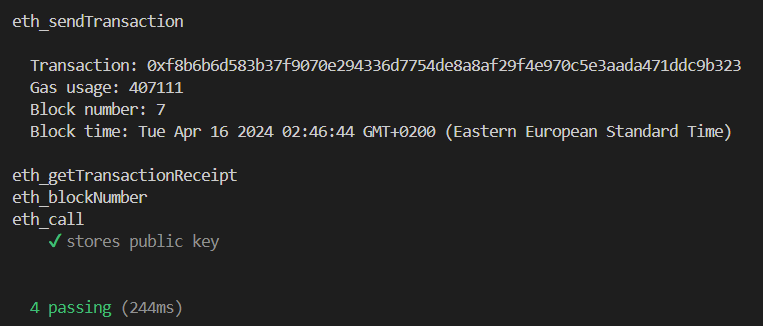

# Handwritten Fonts

Create handwritten fonts from your own handwriting and send messages via any messaging platform in your handwriting.

This project includes a Desktop Application for font generation, and a Chrome Extension for sending and displaying messages in handwritten fonts, and leverages fully decentralized technologies (IPFS and Ethereum Blockchain) for all storage and processing logic, and its own encryption system for security.

## Usage (For Users)

## Usage (For Developers)

### Desktop App

1.  Install Maven
1.  Move into the desktop application's backend directory.
    ```bash
    cd "Desktop App/backend"
    ```
1.  Add dependencies to the local Maven Repository. (These dependencies aren't present on the Maven Central Repository so they were downloaded manually, added to the lib folder of the project, then they must be added to the local Maven Repository)

    ```bash
    mvn install:install-file -Dfile='lib/doubletype.jar' -DgroupId='com.example' -DartifactId='doubletype' -Dversion='1.0' -Dpackaging=jar
    mvn install:install-file -Dfile='lib/geomerative.jar' -DgroupId='com.example' -DartifactId='geomerative' -Dversion='1.0' -Dpackaging=jar
    mvn install:install-file -Dfile='lib/sfntly.jar' -DgroupId='com.example' -DartifactId='sfntly' -Dversion='1.0' -Dpackaging=jar
    mvn install:install-file -Dfile='lib/sfnttool.jar' -DgroupId='com.example' -DartifactId='sfnttool' -Dversion='1.0' -Dpackaging=jar
    mvn install:install-file -Dfile='lib/catalina.jar' -DgroupId='org.apache.tomcat' -DartifactId='tomcat-catalina' -Dversion='1.0' -Dpackaging=jar
    ```

1.  Build the Java App into one JAR file including all dependencies

    ```bash
    mvn clean install
    ```

1.  Download and Install FontForge

1.  Add the fontforge executable/binary file to your system's path

1.  Start the Electron App

    ```bash
    npm start
    ```

### Browser Extension

## Tech Stack

**Desktop App:**

- Electron
- React
- Electron-React Boilerplate Template
- TypeScript
- Cropper.js
- Tailwind
- DaisyUI
- Java
- Fontastic
- FontForge

**Browser Extension:**

- Vite
- React
- TypeScript
- Tailwind
- DaisyUI
- Web3.js
- NFT.Storage
- JSEncrypt
- Crypto-JS

## Tests

Unit tests were developed for the Ethereum Smart Contract using Mocha, Ganache and Web3.js.



## Author

[@mahmoudaboueleneen](https://github.com/mahmoudaboueleneen)

## Credits

## References
