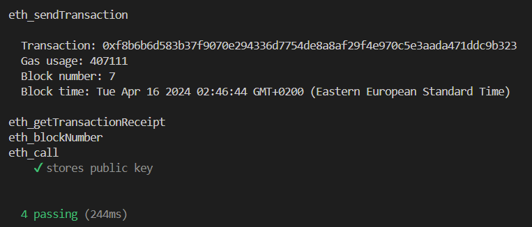
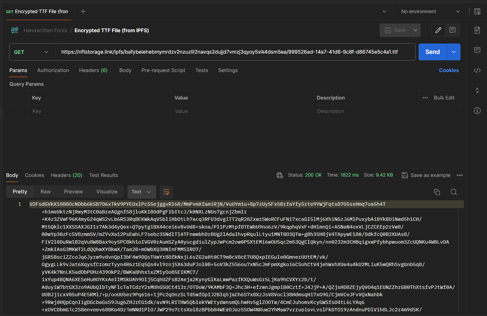

# Handwritten Fonts

Create handwritten fonts from your own handwriting and send messages via any messaging platform in your handwriting.

This project includes a Desktop Application for font generation, and a Chrome Extension for sending and displaying messages in handwritten fonts, and leverages fully decentralized technologies (IPFS and Ethereum Blockchain) for all storage and processing logic, and its own encryption system for security.

## Usage For Users

This project has yet to be deployed.

## Developer Usage

1. Clone the repository

   ```bash
   git clone https://github.com/mahmoudaboueleneen/T13-Handwritten-Fonts.git
   ```

### Desktop App

1. Download and Install `Maven` and `FontForge` and ensure they are both added to your system's PATH environment variable.

1. Move into the Desktop App directory and into the Java directory

   ```bash
   cd "Desktop App"
   cd src/java
   ```

1. Manually add some required dependencies from the `lib` folder to the local Maven Repository. (These dependencies aren't present on the Maven Central Repository so they were downloaded manually, added to the lib folder of the project, and so they must be added to the local Maven Repository)

   ```bash
   mvn install:install-file -Dfile='lib/doubletype.jar' -DgroupId='com.example' -DartifactId='doubletype' -Dversion='1.0' -Dpackaging=jar
   mvn install:install-file -Dfile='lib/geomerative.jar' -DgroupId='com.example' -DartifactId='geomerative' -Dversion='1.0' -Dpackaging=jar
   mvn install:install-file -Dfile='lib/sfntly.jar' -DgroupId='com.example' -DartifactId='sfntly' -Dversion='1.0' -Dpackaging=jar
   mvn install:install-file -Dfile='lib/sfnttool.jar' -DgroupId='com.example' -DartifactId='sfnttool' -Dversion='1.0' -Dpackaging=jar
   mvn install:install-file -Dfile='lib/catalina.jar' -DgroupId='org.apache.tomcat' -DartifactId='tomcat-catalina' -Dversion='1.0' -Dpackaging=jar
   ```

1. Build the Java App into one JAR file including all dependencies

   ```bash
   mvn clean install
   ```

1. Start the Electron App

   ```bash
   cd ../..
   npm start
   ```

### Browser Extension

1. Move into the Browser Extension directory

   ```bash
   cd "Browser Extension"
   ```

1. Install dependencies

   ```bash
   npm install
   ```

1. Build the extension into a `dist` folder

   ```bash
   npm run build
   ```

1. Go to `chrome://extensions/` on your Chrome browser

1. Turn on `Developer mode`

1. Click on `Load unpacked`

1. Find and select the generated `dist` folder

1. Pin the extension to your Chrome browser and start using it on any webpage.

## Tech Stack

**Desktop App**

- Electron
- React
- Electron-React Boilerplate Template
- TypeScript
- Cropper.js
- Tailwind
- DaisyUI
- Java
- Maven
- Fontastic
- FontForge

**Browser Extension**

- Vite
- React
- TypeScript
- Tailwind
- DaisyUI
- Web3.js
- NFT.Storage
- JSEncrypt
- Crypto-JS

## Tests

Unit tests were developed for the Ethereum Smart Contract using Mocha, Ganache and Web3.js.



Postman was also used to test fetching encrypted font files from the IPFS



## Author

[@mahmoudaboueleneen](https://github.com/mahmoudaboueleneen)

## Credits

## References
