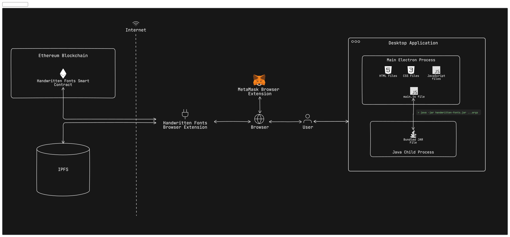

# Handwritten Fonts



## Getting Started

Move into the desktop application's backend directory.

```bash
cd "Desktop App/backend"
```

Add dependencies to the local Maven Repository. (These dependencies aren't present on the Maven Central Repository so they were downloaded manually, added to the lib folder of the project, then they must be added to the local Maven Repository)

```bash
mvn install:install-file -Dfile='lib/doubletype.jar' -DgroupId='com.example' -DartifactId='doubletype' -Dversion='1.0' -Dpackaging=jar
mvn install:install-file -Dfile='lib/geomerative.jar' -DgroupId='com.example' -DartifactId='geomerative' -Dversion='1.0' -Dpackaging=jar
mvn install:install-file -Dfile='lib/sfntly.jar' -DgroupId='com.example' -DartifactId='sfntly' -Dversion='1.0' -Dpackaging=jar
mvn install:install-file -Dfile='lib/sfnttool.jar' -DgroupId='com.example' -DartifactId='sfnttool' -Dversion='1.0' -Dpackaging=jar
mvn install:install-file -Dfile='lib/catalina.jar' -DgroupId='org.apache.tomcat' -DartifactId='tomcat-catalina' -Dversion='1.0' -Dpackaging=jar
```

Build the Java App into one JAR file including all dependencies

```bash
mvn clean install
```

Start the Electron App

```bash
npm start
```

## Tech Stack

**Desktop App:**

- Electron
- React
- TypeScript
- Cropper.js
- Tailwind
- DaisyUI
- Java
- Fontastic

**Browser Extension:**

- Vite
- React
- TypeScript
- Tailwind
- DaisyUI
- Web3.js
- NFT.Storage
- JSEncrypt
- Crypto-JS

## Tests

## Author

## Credits

## References
